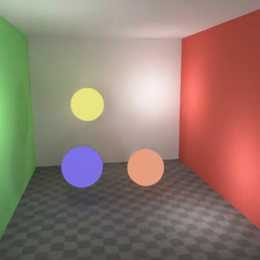
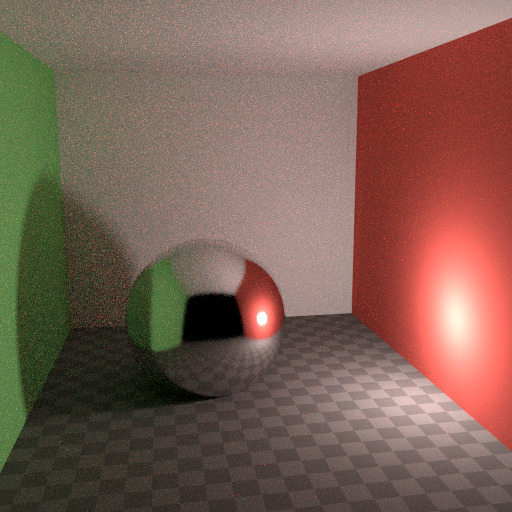
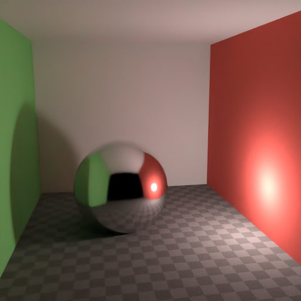

# Summary
Example implementation of new Optix 7.0.0 denoiser feature withing single header C++ file.
Code was compiled with Visual Studio Compiler v1922.

# Important
 - Work in progress of HDR bitmap support (data range and gamma correction for HDR2LDR)
 - For now this implementation supports only 4 channel pixel data (R,G,B,A) and only PNG file format.
 - Optix Denoiser uses the format OPTIX_PIXEL_FORMAT_FLOAT4 so the raw pixel data has to be recalculated (from unsigned char to float) and it takes some time
 - Doesn't supports Albedo and Normal bitmaps yet (lack of details in documentation)

# Requirements
- C++ 14
- Optix 7.0 SDK (https://developer.nvidia.com/designworks/optix/download)
- CUDA Toolkit 10.1 Update 2 (https://developer.nvidia.com/cuda-downloads)
- PNG Encoder/Decoder LodePNG (https://github.com/lvandeve/lodepng)
- EXR Encoder TinyEXR (https://github.com/syoyo/tinyexr) (HDR doesnt work properly yet)

# Denoiser options
- For function CreateDenoiser there are two supported trained AI models (OptixImageType::HDR, OptixImageType::LDR)
- For function Denoise there are three parameters to adjust 
1) float blendFactor - "blendFactor to interpolate between the noisy input image (1.0) and the denoised output image (0.0)."
2) unsigned int denoiseAlpha - "can be used to disable the denoising of the (optional) alpha channelof the noisy image"
3) bool calculateItenstity - If true then it runs the intenstity calculation function for image

# Example code
It is worth to mention that denoising multiple images requires to use all of the 
functions from Init() to Clear() to successfully release all of the used memory during denoising process.

```C++
#include <optix_function_table_definition.h> //Needs to be only in one translation unit
#include "OptixDenoiserUtils.h"

int main()
{
	OptixDenoiserUtils optix{};
	try
	{
		optix.Init();
		optix.SetRGB("bathroom_noise.png");
		//optix.SetAlbedo("bathroom_noise.png");
		optix.CreateDenoiser(OptixImageType::HDR);
		optix.Denoise(0.0f, 0, true);
		optix.SaveImage("denoised_exr.png");
		optix.Clear();
	}
	catch (std::exception& e)
	{
		std::cout << e.what();
	}
}
```

# Results
Image source for noised images: http://builder.openhmd.net/blender-hmd-viewport-temp/render/cycles/optimizations/reducing_noise.html

With noise


Denoised with Optix



With noise



Denoised with Optix


